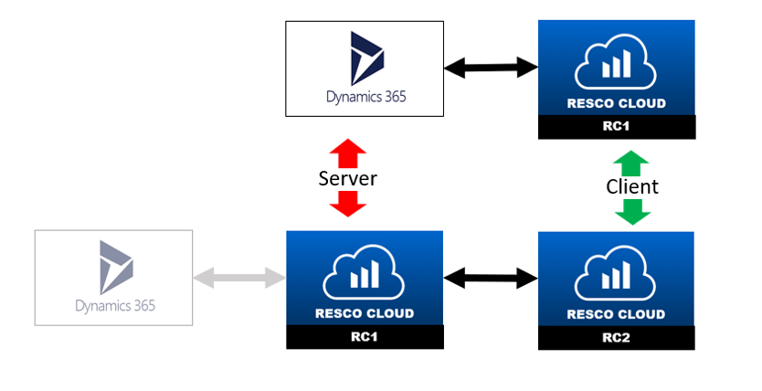

# Resco CRM Sync

This document is a brief summary of actual status of Resco CRM Sync.

# Content:
1. Getting started with Resco CRM Sync
2. Creating a connection
3. Updating metadata
4. Sync Data
5. Sync of deletions
6. Offline transactions
7. Sync job

# 1. Getting started with Resco CRM Sync
Resco CRM Sync is a tool that allows connecting two organizations. By creating a connection, you can synchronize data and metadata between them.  

The position of the organization can be as: 
a) Server: The organization from which you create a client. Updates of metadata (on demand) and data (periodically) are sent to the client. 
b) Client: Updates of data are instantly or periodically sent to the server. Update of metadata can be pulled from server on demand. 

