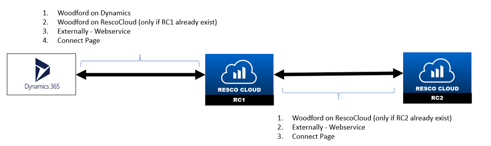
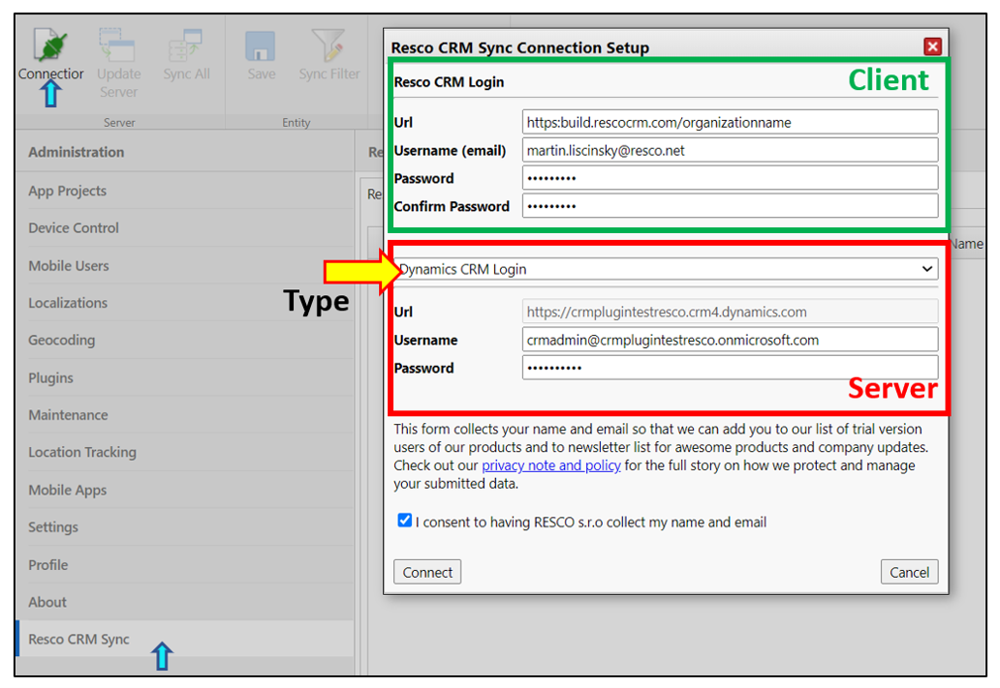
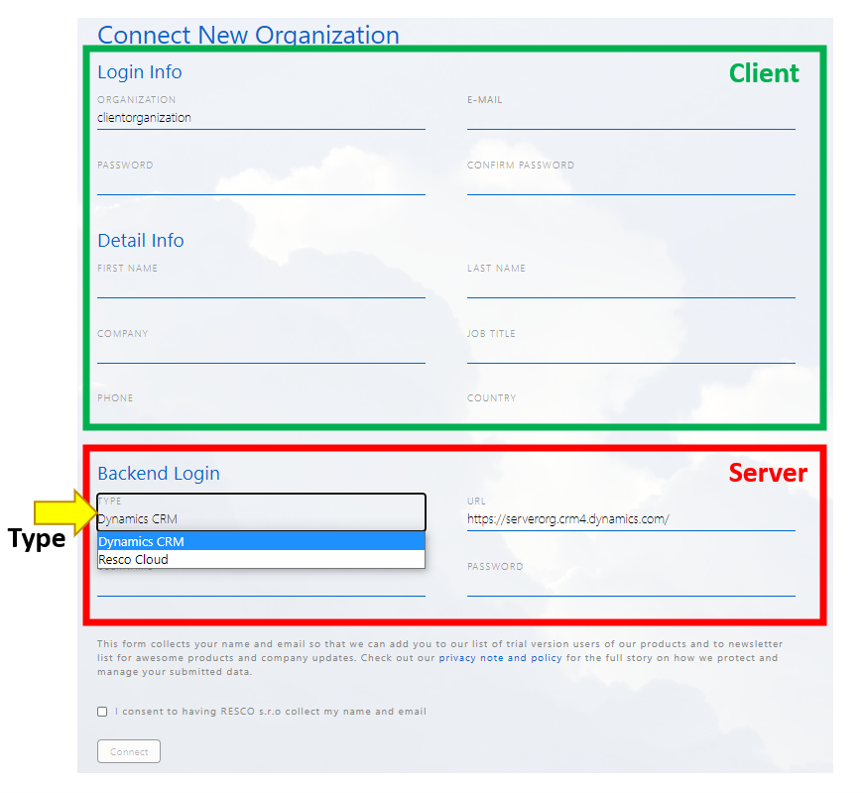
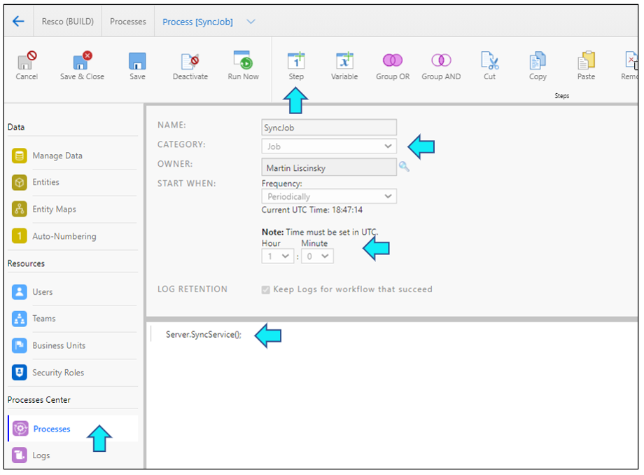
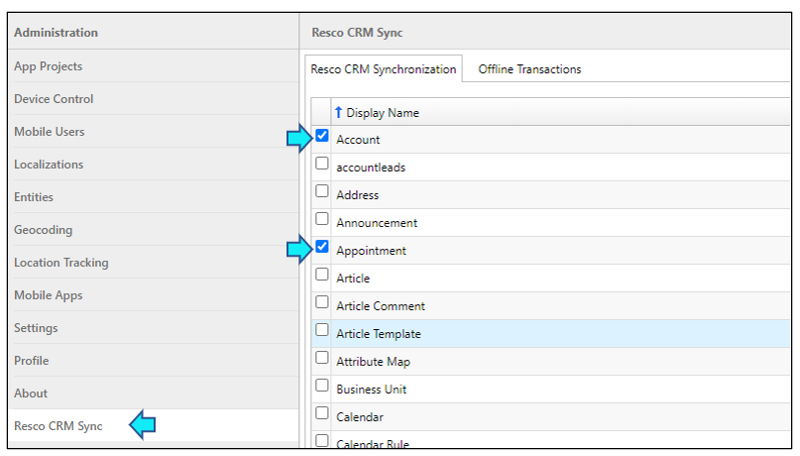
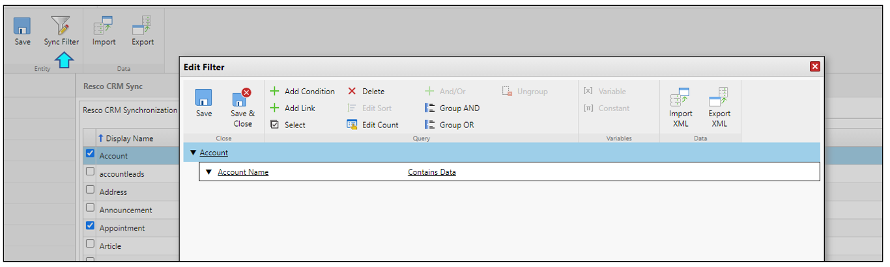
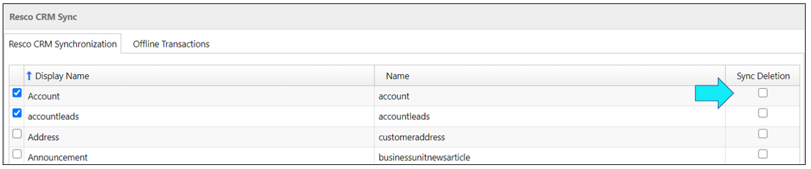
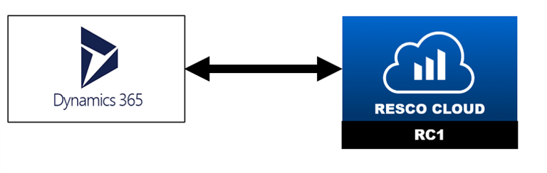
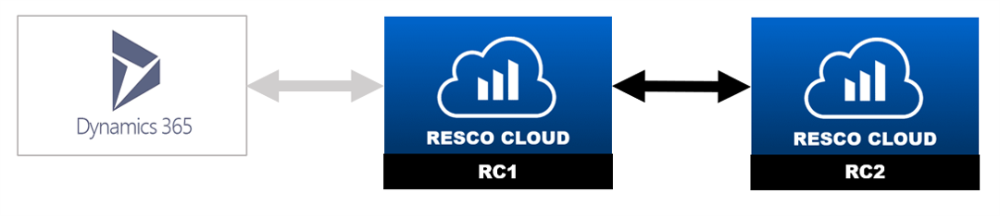

# Resco CRM Sync

This document is a brief summary of actual status of Resco CRM Sync.<br/>
Todo list (topics to discussion):
- TFS: Definition of Ready, Definition of Done, User Story, Tasks, connect existing bugs to the User story

- Enable Connect Page on production server
- Which scenarios should be tested/accepted
- Develope Automated tests
- Rename Update Server to Update Client Metadata?
- Define better examples of webrequests to this document?
- Plan to the future<br/>

Already found BUGS:
- Connect - need to implement oAuth 2.0: https://dev.azure.com/resconet/MobileCRM/_workitems/edit/11691
- Sync Deletion of N:N throws an exception - all scenarios
- Sync filters are not allways respected - need to investigate why
- Sometimes this error occurs:
```xml
<soap> SqlException: Transaction (Process ID 67) was deadlocked on lock resources with another process and has been chosen as the deadlock victim. Rerun the transaction. </soap>
```
- Connect throws an exception (special scenario) - default project: https://dev.azure.com/resconet/MobileCRM/_workitems/edit/12355

# Content:
1. Getting started with Resco CRM Sync
2. Creating a connection
3. Updating metadata
4. Sync Data
5. Logs
6. Tests

# 1. Getting started with Resco CRM Sync
Resco CRM Sync is a tool that allows connecting two organizations. By creating a connection, you can synchronize data and metadata between them.<br/><br/>

The position of the organization can be as:<br/>
a) `Server`: The organization from which you create a client. Updates of metadata (on demand) and data (periodically) are sent to the client.<br/>
b) `Client`: Updates of data are instantly or periodically sent to the server. Updates of metadata can be pulled from server on demand.<br/>


# 2. Creating a connection

## a) From Woodford
1. Navigate to Woodford
2. Resco CRM Sync section
3. Connectior
4. Fill in info about `client` organization
5. Select `backend type` of server organization
6. Fill in info about `server` organization
7. Click on Connect button


## b) Externally - Webservice
```bash
https://connect.rescocrm.com/rest/v1/sync/myclientorganization/ConnectAsync
```
```xml
<ConnectRequest>     
    <SyncSetup>         
        <ProviderID>60650fb3-5d8b-45dd-b82e-459f3b019e9a</ProviderID>        
        <Url>urlofserverorganization</Url>   
        <UserName>martin.liscinsky@resco.net</UserName>       
        <Password>xxx</Password>         
        <RegistrationInfo>             
            <Email>martin.liscinsky@resco.net</Email>             
            <FirstName>Martin</FirstName>             
            <LastName>Liscinsky</LastName>             
            <Company>Resco</Company>         
        </RegistrationInfo>    
    </SyncSetup> 
</ConnectRequest>
```
## c) Connect Page - !!! Need to allow on our production servers !!!
https://connect.rescocrm.com/Register.aspx?otype=connect <br/>
https://build.rescocrm.com/Register.aspx?otype=connect <br/>
1. Navigate to one of the url above.
2. Fill in info about new `client` organization.
3. Select `backend type` of server organization.
4. Fill in info about `server` organization.
5. Click on Connect button.


# 3. Updating metadata - !!!Rename to Update Client, not Update Server???!!!
Synchronization of metadata can be executed on demand:<br/> 
a) by clicking `Update Server` button, which is part of the Resco CRM Sync section in Woodford. <br/>
b) through webservice - ConnectRequest<br/>
*`Important note`: Server metadata changes are migrated to the client, not vice versa.*

# 4. Sync Data
## Ways of Sync data execution
a) `Sync All` - On demand - by clicking Sync All (Resco CRM Sync section, in Woodford)<br/>
b) `Sync Job` - Periodically - by setting frequency of synchronization on the client.<br/> You can set it up in Admin Console->Processes. If the job (Sync Job) does not exist, you can create it. 
1. Click New
2. Select Job category
3. Enter descriptive name
4. Configure frequency (e.g Periodically, every Hour)
5. Insert a new step (click Step and select Function) and enter  the following Server SyncService
6. Click Save
7. Publish
8. Activate


c) `Webservice`<br/>

```bash
https://build.rescocrm.com/rest/v1/sync/mtestingdyn2connect/SyncAsync
```
## Sync Data Execute from Server to Client
Once, is Sync executed by one of the way of execution descibed above, data are sent from Server to Client.
## Sync Data Execute from Client to Server
It depends on CrmWritePlugin.config setting `<add key="WriteOffline" value="true"/>`.<br/>
a) value = `"false"` <br/>
- Updates of data are sent to Server immediately.<br/>

b) value = `"true"` <br/>
- Info about data changes are stored to `[migrate_transaction]` entity. 
Once, is Sync executed by one of the way of execution descibed above, data are sent from Client to Server.<br/>
- In addition, Resco CRM Sync offers `Offline transaction tab`, for managing data transactions (records of `[migrate_transaction]` entity) from Client to Server.

## Offline Transactions tab
It shows the individual transactions along with their Status:<br/>
`All` - all transactions<br/>
`Pending` - transactions waiting for upload<br/>
`Processed` - transactions successfully delivered to Dynamics<br/>
`Error` - transactions unsuccessfully delivered<br/>
    - In this case, transactions also contain `log-error message`, which could be analyzed.<br/> 
`Archived` - transactions manually marked as Archived<br/><br/>
Use the toolbar buttons to change the status of transactions:<br/>
`Set to Pending`: Schedule selected transactions for a new delivery.<br/>
`Set to Archived`: Mark selected transactions as Archived. These changes will not be delivered to Dynamics.<br/>
`Set all to Pending`: Schedule all failed transactions (with the status Error) for a new delivery. <br/><br/>
In the case of errors, transactions also contain `log-error message`, which could be analyzed. 

## Entities selection
Selecting of entities, which should be synchronized can be done:<br/>
a) by enabling them in the list of entities in Resco CRM Sync section in Woodford <br/>
<br/>
b) through webservice in ConnectRequest as Entities parameter <br/>
## Sync Filter
There´s possibility to apply `Sync Filter` per entity:<br/>
a) by clicking Sync Filter button, (Resco CRM Sync section). And setting conditions in the editor. <br/>

b) through webservice in ConnectRequest as SyncFiltersXml parameter <br/>

## Sync Deletion
For each entity, there´s possibility to customize how to handle delete operations and ownership changes on Server.<br/>
a) `Disable Sync Deletion` checkbox to use incremental synchronization for the entity<br/>

b) `Enable Sync Deletion` checkbox to synchronize also deletions and ownership changes. This makes syncrhonization slower, particulary for large tables.
In scenario, when backend type of Server organization is Dynamics, Resco CRM Sync offers `Advanced Sync Deletion`, which should solve this problem.

## Advanced Sync Deletion
It´s able to use it only if Server organization is Dynamics.<br/>
This function use the `Plugins` that Resco designed for Dynamics to track records `deletions` and `owner changes`, to greatly improve synchronization times for large organizations.
### How to setup Advanced Sync Deletion?
a) Select what to track on the `Server` organization<br/>
1. Log in to your source organization (Dynamics).
2. Start Woodford and select `Plugins` from the Administration menu.
3. Select what actions do you want to track:
    - On the `N:N Relationships tab`, select which relations should be tracked.
    - On the `Delete tab`, select entities for which deletions should be tracked.
    - On the `Owner tab`, select entities for which ownership changes should be tracked.
4. Click Save to save changes.

b) Select what entities to sync<br/>
1. Log in to either organization (Resco Cloud or Dynamics).
2. Start Woodford and select Resco CRM sync from the Administration menu.
3. Select the entities you want to synchronize.
4. Clear Sync Deletion for these entities.
5. Additionally, you need to enable synchronization for the entity `Mobile Tracking [resco_mobiletracking]`.

# 5. Logs
Synchronizations between servers could bring some issues, therefore are logs from synchronization collected to `[migrate_log]` entity.

# 6. Tests
## Creating connection
1. Different scenarios of creating connection between Dynamics and RescoCloud:<br/>
a) `Dynamics <-> New RC1 organization`<br/>
b) `Dynamics <-> Existed – as Sales` <br/>
c) Dynamics <-> Existed – created from another Dynamics organization (as a))<br/>
d) Dynamics <-> Existed – created from another Dynamics organization (as b))<br/>
!!! BUG: Connect to new trial organization on Dynamics need to implement oAuth 2.0 <br/>


2. Different scenarios of creating connection between two RescoCloud organizations:<br/>
a) `RC1 as 1a) <-> new RC2`<br/>
b) RC1 as 1b) <-> new RC2<br/>
c) RC1 as 1c) <-> new RC2<br/>
d) RC1 as 1d) <-> new RC2<br/><br/>
e) RC1 as 1a) <-> RC2 - Existed – as Sales<br/>
f) RC1 as 1b) <-> RC2 - Existed – as Sales<br/>
g) RC1 as 1c) <-> RC2 - Existed – as Sales<br/>
h) RC1 as 1d) <-> RC2 - Existed – as Sales<br/><br/>
i) `RC1 as 1a) <-> RC2 -Existed – (as 1a)`<br/>
j) RC1 as 1b) <-> RC2 -Existed – (as 1b)<br/>
k) RC1 as 1c) <-> RC2 -Existed – (as 1c)<br/>
l) RC1 as 1d) <-> RC2 -Existed – (as 1d)<br/>


## Updating metadata
1. Create: Add new custom Entity do Dynamics
2. Update: Add new attribute to entity which exist
3. Update: Change something in entity/entity.attribute, which exist
4. Update: Remove some entity.attribute, which exist 
5. Remove: Remove some entity
6. Localizations: Change localizations of some entities.

It is necessary to make `metadata|localizations` changes to the `Server` organization.<br/>

## Sync Data
1. Create/Update new records on Server
2. Create/Update new records on Client
3. Sync All
4. Check both organizations if records were created/updated
5. Apply some `Sync Filters` and `repeat steps 1-4`

It is necessary to `repeat steps 1-5` for:<br/>
a) `Standard entities`: [account], [lead], [competitor]<br/>
b) `N:N (intersect)`: [leadcompetitor]<br/>
c) `Activities`: [appointment]<br/>
d) `Special`: [systemuser], [roleprivileges], [systemuser_role], [role]<br/>
e) `Custom`<br/>

!!! Entities which throw an exception if you try sync them (Should we hide them from the list)???<br/>
`[calendarrule]` –<br/> 
`[commitment]` - <br/>
`[plugintype]` - <br/>
`[resco_questionnairefolder]` - <br/>
...!!!TODO: investigate if they still throw an exception

## Sync Deletion
1. Delete records on Server
2. Enable Sync Deletion for the entities to sync
3. Sync All
4. Check Client organization if records were deleted
5. Apply some `Sync Filters` and `repeat steps 1-4`
 

It is necessary to `repeat steps 1-5` for:<br/>
a) `Standard entities`: [account], [lead], [competitor]<br/>
b) `N:N (intersect)`: [leadcompetitor]<br/>
c) `Activities`: [appointment]<br/>
d) `Special`: [systemuser], [systemuser_role], [role]<br/>
e) `Custom`<br/>

## Advanced Sync Deletion
Follow steps from:  `How to setup Advanced Sync Deletion?`<br/><br/>

---
